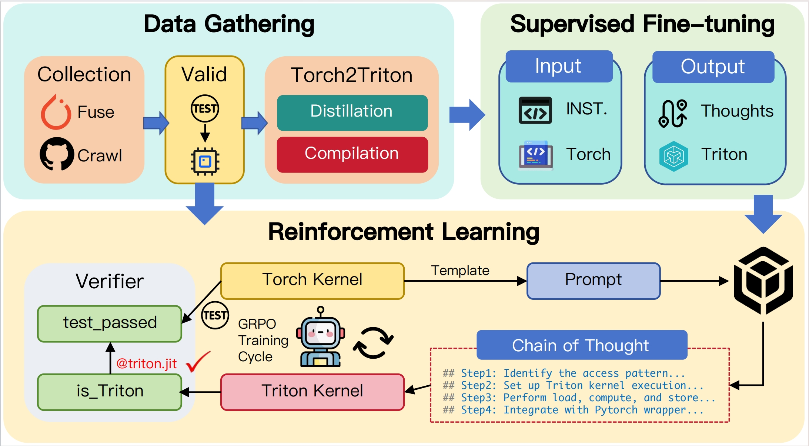

# AutoTriton: Automatic Triton Programming with Reinforcement Learning in LLMs

[](https://huggingface.co/ai9stars/AutoTriton) [](https://arxiv.org/abs/2507.05687)

## Overview



In this work, we introduce AutoTriton, the first model dedicated to Triton programming powered by reinforcement learning (RL). AutoTriton performs supervised fine-tuning (SFT) to be equipped with essential Triton programming expertise using a high-quality data gathering pipeline, and conducts RL with Group Relative Policy Optimization (GRPO) algorithm, combining a rule-based reward and an execution-based reward to further improve Triton programming ability, sequentially. Experiments across five evaluation channels of TritonBench and KernelBench illustrate that our 8B model AutoTriton achieves performance comparable to mainstream large models, including Claude-4-Sonnet and DeepSeek-R1-0528.

## Model Use

We provide the model weights of [AutoTriton](https://huggingface.co/ai9stars/AutoTriton), which is trained based on [Seed-Coder-8B-Reasoning](https://huggingface.co/ByteDance-Seed/Seed-Coder-8B-Reasoning). 

## Contact

For any questions, you can contact [qshi9510@gmail.com](mailto:qshi9510@gmail.com).

## Citation
If you find this work useful, consider giving this repository a star ⭐️ and citing 📝 our paper as follows:
```
@article{li2025autotriton,
  title={AutoTriton: Automatic Triton Programming with Reinforcement Learning in LLMs},
  author={Li, Shangzhan and Wang, Zefan and He, Ye and Li, Yuxuan and Shi, Qi and Li, Jianling and Hu, Yonggang and Che, Wanxiang and Han, Xu and Liu, Zhiyuan and others},
  journal={arXiv preprint arXiv:2507.05687},
  year={2025}
}
```

## Acknowledgement

The work is initiated and supported by the [AI9Stars](https://github.com/AI9Stars) Team. We are grateful for the support of the [OpenBMB](https://github.com/OpenBMB) and [InfiniteTensor](https://github.com/InfiniTensor) teams.
