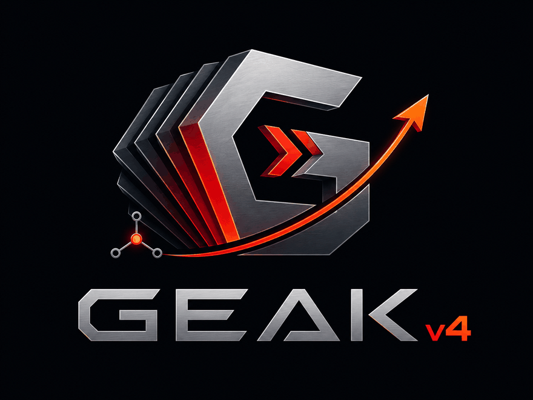
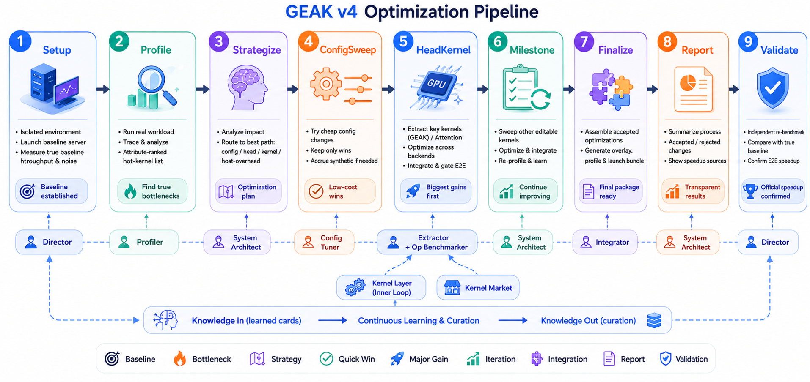

<p align="center">
  
</p>

Multi-agent GPU performance optimization for **AMD Instinct MI GPUs** (CDNA, e.g. gfx942 / gfx950 — the
on-box card is auto-detected). Driven by Claude Code, orchestrated by deterministic JS **Workflows**.

Two workflows ship here:

| Workflow | Scope | What it optimizes |
| --- | --- | --- |
| **[e2e_workflow](e2e_workflow/)** ⭐ | Whole-model serving | End-to-end **sglang / vLLM throughput** of a full LLM |
| [kernel_workflow](kernel_workflow/) | Single kernel | Latency / speedup of a single AMD GPU kernel (Triton, HIP, CK, FlyDSL, …) |

> **e2e_workflow is the headline.** It raises the serving throughput of a real model by triaging hot
> kernels and pulling levers cheapest-first, then *recursively* calls the single-kernel kernel_workflow to
> author/optimize the kernels worth fixing. If you only want to speed up one kernel, use kernel_workflow directly.

---

## Architecture

<p align="center">
  
</p>

---

## Getting started

### 1. Prerequisites

- An **AMD Instinct MI GPU** (CDNA, e.g. gfx942 / gfx950), **ROCm 6+**, a profiler (`rocprof-compute` /
  `rocprofv3` / `rocprof`), Python 3.8+.
- For E2E: a running-capable serving backend (`sglang` or `vllm`) and the model weights on disk.

### 2. Set up

```bash
git clone https://github.com/AMD-AGI/GEAK.git && cd GEAK
bash setup.sh
```

It leaves **PATH and API access** setting in Claude Code to you — follow its printed next-steps to add `~/.local/bin` to
PATH and to configure Anthropic API access. 

### 3. Launch Claude Code in auto mode

The workflows spawn many sub-agents and run profiling / benchmark / build commands on the box, so run
Claude Code with permissions auto-approved (≥ 2.1.177 for the dynamic Workflow feature):

```bash
IS_SANDBOX=1 claude --dangerously-skip-permissions
```

Then just describe what you want in natural language (examples below). Claude Code resolves the paths and
invokes the `Workflow` tool for you.

---

## e2e_workflow — whole-model serving throughput ⭐

`e2e_workflow/` raises the **sglang / vLLM serving throughput** of a whole LLM. It is a *system layer*
that wraps — and recursively calls — the single-kernel kernel_workflow:

1. **Preflight** the env (GPU arch, backend, model).
2. **Profile** a running server on your exact workload.
3. **Triage** hot kernels by **Amdahl** (`pct_gpu_time × achievable_speedup`).
4. **Pull levers cheapest-first** — config/backend sweep → head GEMM/attention bake-off (aiter per-shape
   tune + a kernel *authored* via the recursive kernel layer, FlyDSL-first for GEMM) → editable-kernel
   milestone loop.
5. **Overlay** each accepted change back **reversibly**, gated on a measured warm-server throughput delta
   (interleaved A/B, 0.5% band + engagement proof + output parity).

Every run writes a complete **`final_report.md`** (with a Phases tree + artifacts tree).

### Example

```
use path_to_GEAK/e2e_workflow to optimize inference for /models/Qwen3.5-27B-FP8, sglang, ISL/OSL=1024, conc=64, gpus 0,1,2,3
```

**Output** lands under `e2e_workflow/exp/e2e_<model>_<timestamp>/` — `final_report.md`,
`architect_report.md`, `final/` (overlay + patch + `final_launch.sh`), and per-stage artifacts.
See a real run in [`examples/e2e_workflow/`](examples/e2e_workflow/).

---

## kernel_workflow — single kernel

`kernel_workflow/` optimizes a single AMD GPU kernel — Triton, HIP, CK, FlyDSL, or any AMD GPU source:
Director → TechLead → specialist engineers (algorithm / memory / compute / host_runtime), multi-round and
budget-controlled, with each patch independently verified before it's accepted.

### Example

```
use path_to_GEAK/kernel_workflow to optimize path_to_GEAK/examples/tasks/knn
```

```
use path_to_GEAK/kernel_workflow to optimize /path/to/silu, budget 8, focus on wrapper overhead
```

### Batch (many kernels at once)

Spawn one agent per kernel with isolated GPU assignments; GPU access is serialized via
`scripts/gpu_lock.sh` (flock-based), so kernels can safely share GPUs.

---

## Why Workflows

Control flow — the budget loop, fan-out, verification, and stop conditions — is **deterministic JS** in
`kernel_workflow.js` / `e2e_workflow.js`. LLM agents are called only for judgement (analysis, strategy,
optimization). This makes runs reliable and reproducible.

## Results — single-kernel

12 HIP kernels, measured on AMD MI300X (gfx942) (excluding mla_decode; FAIL counted as 1.0x):

| Method | LLM | Geo Mean |
| ------ | --- | -------- |
| GEAK_v3 (baseline) | Opus 4.8 | 1.90x |
| **kernel_workflow** | Opus 4.8 | **3.68x** |

> kernel_workflow is measured with unified baselines (3 runs, median); GEAK_v3 uses each run's own
> baseline. Per-kernel breakdowns:
> [original](examples/result/hip2hip_comparison.md) ·
> [reproducibility](examples/result/hip2hip_repro_comparison.md).

## Repository layout

```
GEAK/
├── e2e_workflow/        # ⭐ End-to-end LLM serving-throughput optimizer (wraps kernel_workflow/)
│   ├── e2e_workflow.js   # system-layer orchestration (config / head-GEMM / kernel tracks + e2e gate)
│   ├── roles/  knowledge/  scripts/   # adapters/{sglang,vllm}.sh, op_bench.py, parse_profile.py, …
│   └── README.md / PLAN.md
├── kernel_workflow/     # Single-kernel optimizer
│   ├── kernel_workflow.js       # deterministic JS orchestration
│   ├── roles/  knowledge/  scripts/   # gpu_lock.sh, profile_kernel.sh
│   └── README.md
├── perf_knowledge/      # AMD operator × backend SOTA knowledge base (REFERENCE ONLY)
├── examples/            # Example kernel tasks, benchmark comparisons, real e2e runs
└── exp/                 # Experiment outputs (timestamped per run)
```

## Approaches compared

How the workflows in this repo relate to the GEAK_v3 baseline:

|                        | GEAK v3 (baseline)                        | kernel_workflow                                                  | e2e_workflow                                                       |
| ---------------------- | ----------------------------------------- | --------------------------------------------------------------- | ----------------------------------------------------------------- |
| **Target**             | Single kernel                             | Single kernel                                                   | **Whole-model sglang/vLLM serving throughput**                    |
| **Agent backend**      | miniswe                                   | Claude                                                          | Claude                                                            |
| **Architecture**       | Orchestrator + parallel workers           | Hierarchical: Director → TechLead → Engineers → Merge           | e2e Director → System Architect → Profiler / Config Tuner / Kernel Extractor / e2e Integrator (wraps the kernel layer) |
| **Iteration**          | Multi-round                               | Multi-round, budget-controlled                                  | Multi-round, Amdahl-triaged, budget-controlled                    |
| **Orchestration**      | Python                                    | **Deterministic JS** — loop/parallelism/verification in code   | **Deterministic JS**                                              |
| **Verification**       | Orchestrator verifies                     | **Pipelined** — each patch verified by a separate agent        | **Warm-server interleaved A/B** — throughput delta + engagement proof + output parity |
| **Engineer types**     | Generic                                   | **Specialist**: algorithm, memory, compute, host_runtime       | System roles + the specialist kernel squad via the recursive layer |
| **Cross-round memory** | miniswe-memory control                    | **Explicit**: insight blackboard + hypothesis ledger           | **Explicit**: insight blackboard + per-backend knowledge          |
| **Best for**           | Programmatic kernel optimization          | Single-kernel gains with high reliability/reproducibility      | **Raising end-to-end serving throughput of a full model**         |

## License

MIT License
